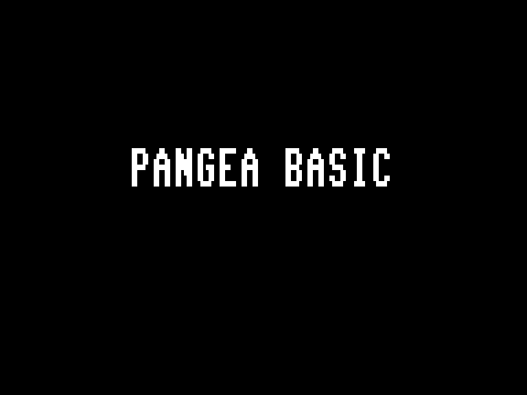
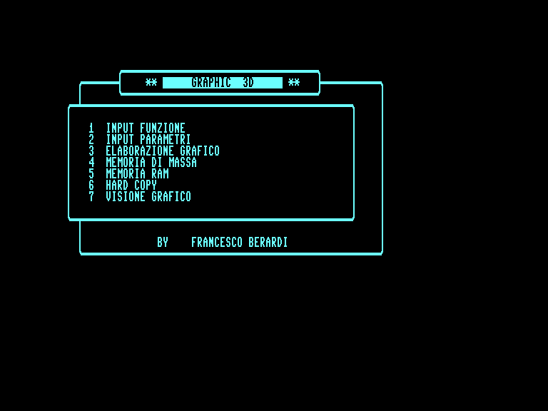
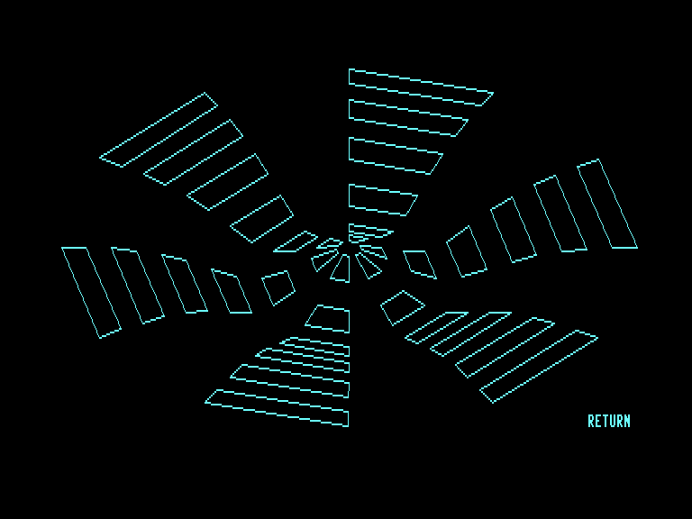

# Pangea Basic for C128

Author: Francesco Berardi\
Publisher: Commodore Gazette (Italy)\
Issue: 1988 n. 2 (March-April)

Typed-in and fixed by Graham (Francesco Gramignani)\
Released on November 19, 2025

## Pangea Basic
Pangea Basic extends BASIC V7 graphics capabilities to VDC video output (80 columns) with a resolution of 640 x 200 pixels.

### Available commands:
- GRAPHIC mode
- SCNCLR 6
- COLOR n, reverse flag
- DRAW mode, x1, y1 to x2, y2 to x3, y3 [to...]
- SAVE "file name", 256, start, end
- LOAD "file name", 256, start
- BOX mode, x1, y1, x2, y2, fill flag
- CHAR 4, x1, y1, "text string", ht, wd, bank, ad
- COPY, x1, y1, xlen, ylen, x2, y2
- COPY "dummy name", D4
- SSHAPE, ad, x1, y1, xlen, ylen
- GSHAPE, ad, x1, y1, xlen, ylen
- CIRCLE mode, xc, yc, xr, yr, an
- HLOAD (import from 40 columns bitmap)

Detailed info in the article scans (published for educational and preservation purposes only).

## Super Quark (included demo)
Through the graphical commands offered by Pangea Basic, Super Quark calculates and displays high-resolution mathematical surfaces.

### Usage
Install Pangea Basic then load Super Quark to try the following functions:

1) XX=SIN(V)\*COS(U)\
YY=SIN(V)\*SIN(U)\
ZZ=COS(V)\
UI=0; US=6.28 ; VI=0 ; VS=3.14

2) XX=U\*SIN(V)\
YY=U\*COS(V)\
ZZ=(U\*U)\*SQR(U\*U)/10\
UI=1; US=2; VI=0; VS=6.28

3) XX=U\
YY=V\
ZZ=SIN(U)\*SIN(V)\
UI=0; US=6.28 or 3.14\
VI=0; VS=6.28 or 3.14\

4) XX=(SIN(U)+3)\*SIN(V)\
YY=(SIN(U)+3)\*COS(V)\
ZZ=COS(U)\
UI=0; US=6.28; VI=0; VS=6.28

5) XX=U\*SIN(V)\
YY=U\*COS(V)\
ZZ=(U\*U)*EXP(-U\*U)\
UI=0; US=3.14; VI=0; VS=6.28\

## Release notes
The source and binary files are distributed in two forms:
- "original" denotes the literal transcription of the published code
- "fixed" is the same program with small changes to fix minor bugs

## Acknowledgments
Thanks to Carlo Provetto who published the complete Commodore Gazette collection via the Dump Club 64 site\
https://www.dumpclub64.it/tales/commodore-gazette/
