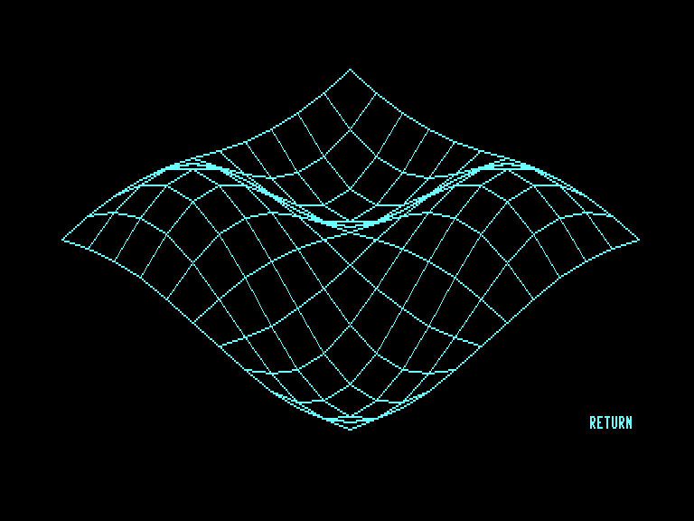

# Pangea Basic for C128

Author: Francesco Berardi\
Publisher: Commodore Gazette (Italy)\
Issue: 1988/2 (March-April)\

Digitized and fixed by Graham (Francesco Gramignani)\
Released on November 19, 2025

Install Pangea Basic then load Super Quark to try the following functions:

1) XX = SIN(V) * COS(U)\
YY = SIN(V) * SIN(U)\
ZZ = COS(V)\
UI = 0; US = 6.28; VI = 0; VS = 3.14

2) XX = U * SIN(V)\
YY = U * COS(V)\
ZZ = (U * U) * SQR(U * U) / 10\
UI = 1 ; US = 2 ; VI = 0 ; VS = 6.28\

3) XX = U\
YY = V\
ZZ = SIN(U) * SIN(V)\
UI = 0 ; US = 6.28 or 3.14\
VI = 0 ; VS = 6.28 or 3.14\

4) XX = (SIN(U) + 3) * SIN(V)\
YY = (SIN(U) + 3) * COS(V)\
ZZ = COS(U)\
UI = 0 ; US = 6.28 ; VI = 0 ; VS = 6.28

5) XX = U * SIN(V)\
YY = U * COS(V)\
ZZ = (U * U) * EXP(-U * U)\
UI = 0 ; US = 3.14 ; VI = 0 ; VS = 6.28\

